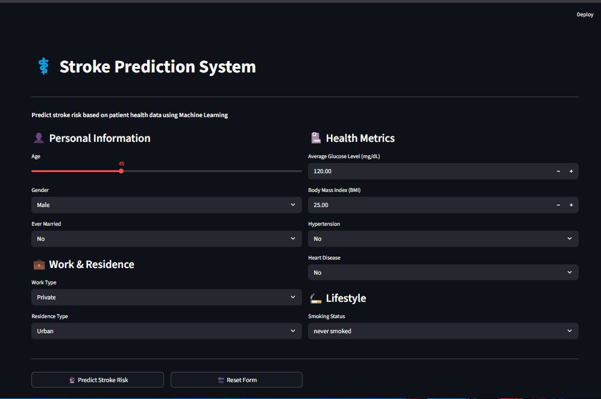

# 🧠 Stroke Prediction System (Machine Learning Powered)

A professional web dashboard built with **Streamlit** to predict the clinical risk of stroke based on patient health data, personal history, and lifestyle factors. The core pipeline is powered by a **Gradient Boosting Classifier** achieving an outstanding **93% prediction accuracy**.

Designed to assist in early health analysis, this interface provides an interactive experience for clinical metric assessments.

---

## 🚀 Live Application

You can try the live app here: **[[[Insert Live Link Here](https://stroke-prediction-system-8hju68peixnvhymfavf7ir.streamlit.app/)]]**

---

## 📸 Application Preview


_(Tip: Replace 'preview.png' with your image path or GitHub asset link)_

---

## 🚀 Key Features

- **Gradient Boosting Core:** High-performance predictive intelligence tuned to analyze tabular clinical datasets.
- **Granular Inputs:** Evaluates diverse dimensions including **Personal Information**, **Health Metrics**, **Work & Residence**, and **Lifestyle Choices**.
- **Streamlined UI/UX:** Dual-column layout featuring responsive interactive widgets (Sliders, Dropdowns, Numeric Toggles, and Form Control Actions).
- **Instant Risk Computation:** Computes and visually marks clinical risk categories inside modern, styled message boxes.

---

## 📁 Project Directory Structure

For clean deployment to GitHub and hosting servers (such as Streamlit Community Cloud), organize your files exactly like this:

```text
├── app.py                  # Main Streamlit web layout script
├── stroke_model.pkl        # Serialized Gradient Boosting Model binary
├── scaler.pkl              # MinMax/Standard Scaler config object (if used)
├── Final_model.pkl         # Serialized Gradient Boosting Model binary
├── columns.pkl             # Feature names for Gradient Boosting Model
├── requirements.txt        # Production dependency lists for server build
├── UI.png                  # App screenshot for Streamlit Community Cloud
└── README.md               # App technical documentation (this file)
```

## 💻 Installation & Setup

Run the following commands in your terminal to clone the repository, install dependencies, and run the project locally:

# Clone the repository

```bash
git clone https://github.com/amirsohail100/Stroke-Prediction-System.git
```

## Navigate into the project directory

```bash
cd Stroke-Prediction-System
```

## Install required packages

```bash
pip install -r requirements.
```

## Run the Streamlit application

```bash
streamlit run app.py


📊 Built an interactive Stroke Prediction Dashboard using Streamlit! Driven by a Gradient Boosting Classifier with 93% accuracy, the web application evaluates clinical inputs—including health metrics, personal details, and lifestyle factors—to compute stroke risk scores instantly. Fully ready for deployment!🧠💻#MachineLearning #DataScience #Python
```
